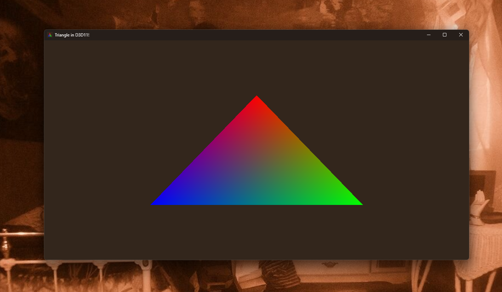

# triangle
Triangle with d3d11



## Building
Launch `x64 Native Tools Command Prompt for VS` clone the repo and run
```bash
.\build.bat
```
You should get a build folder which should contain the executable
```bash
.\build\Triangle.exe
```